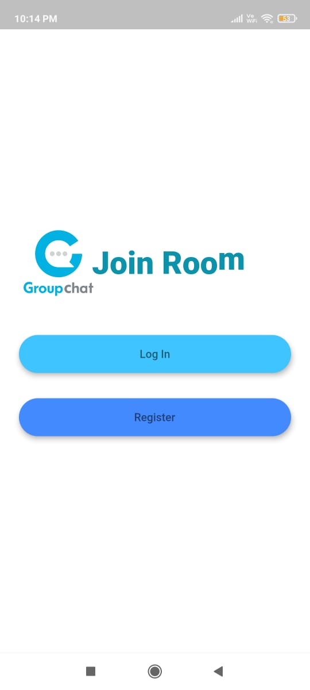
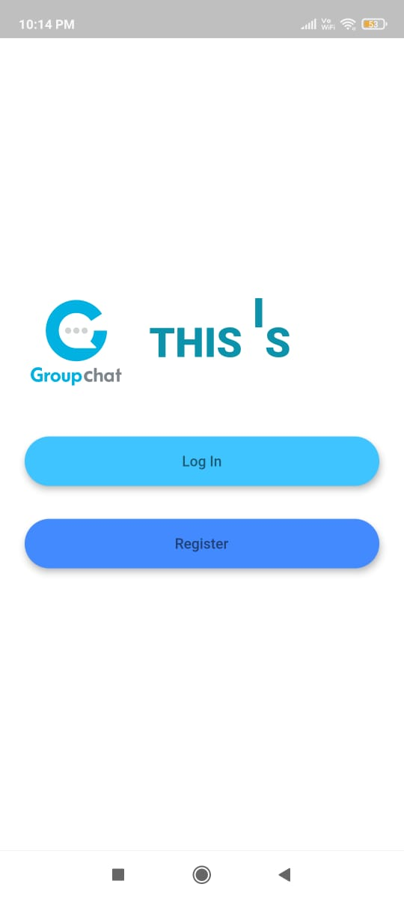
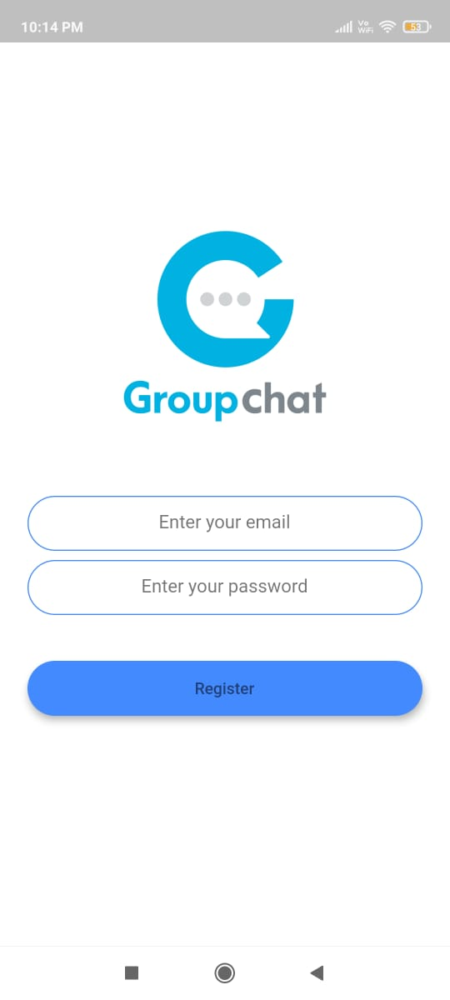
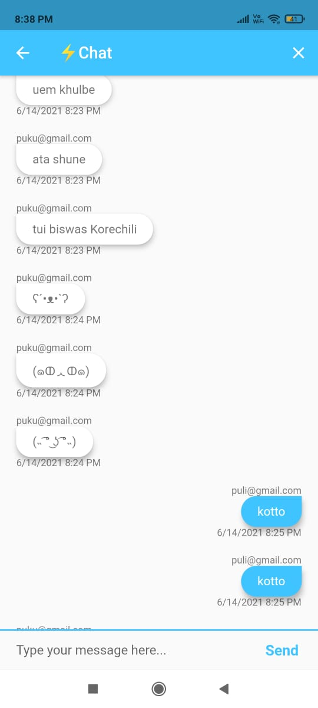
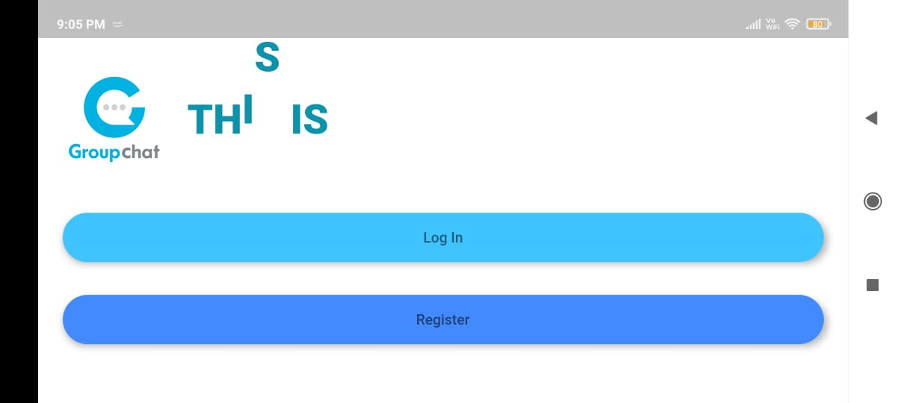
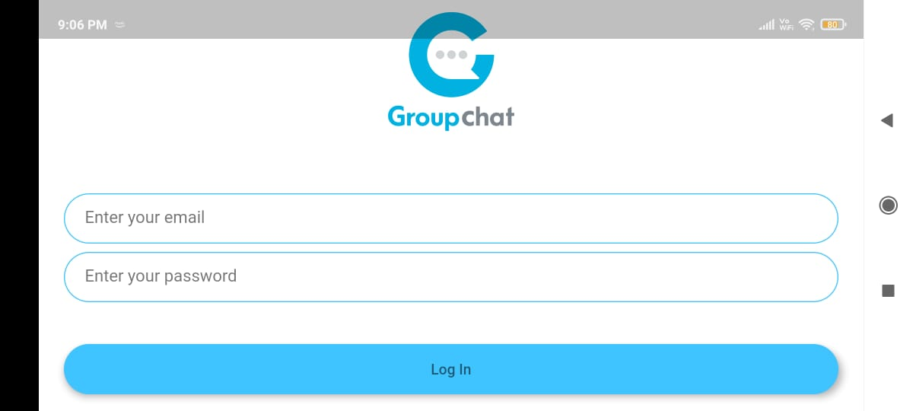
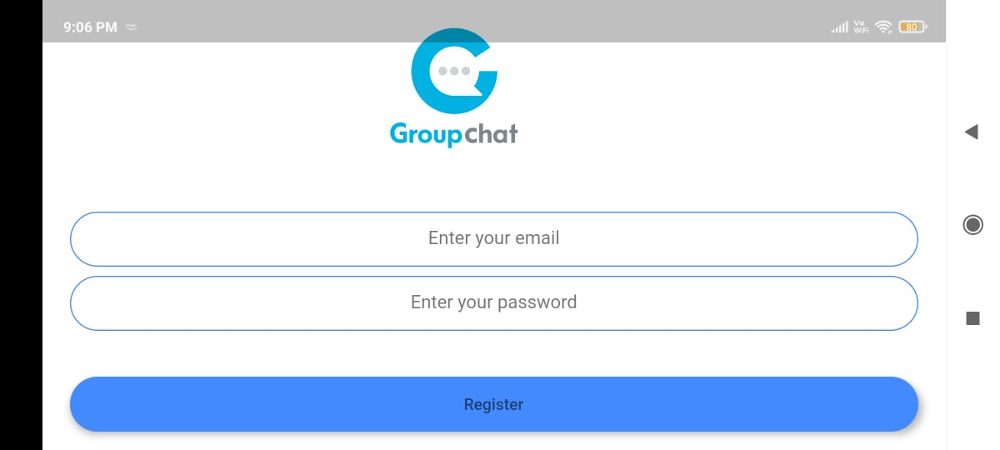
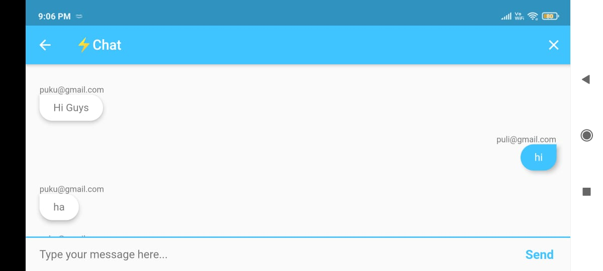

# GROUPCHAT_FLUTTER_APPLICATION :star_struck: 
:wink: :heart: :fire: :thumbsup: :speech_balloon: :couplekiss:

[](https://shields.io/) [](https://shields.io/) [](https://shields.io/) [](https://shields.io/) [](https://shields.io/) [](https://shields.io/) [](https://shields.io/) [](https://shields.io/) [](https://shields.io/)

***This new Flutter application named 'GROUP CHAT' is created by Biswarup Bhattacharjee, student of BTECH, in University of Engineering and Management, Kolkata.***

**Email Id: bbiswa471@gmail.com.** 

**Contact No: 916290272740.** 

[](https://www.facebook.com/biswarup.bhattacharjee.5811) [](https://github.com/biswa2210)

## About :point_down: 

<div align="justified">
It is a new ,simple real time chatting application. I have made this with Flutter. By installing an application in our android or iphone we can use this app. Here user first has to register with email id and password. After that user has to login with that email id and password to get started with chatting. Whoever has the app can start chatting. The chats are safe and no one accept users can acces the chats. While chatting whoever is chatting his or her email id will be shown there. It is a very useful and easy to use app for chatting safely with our family, friends or whoever we want. Everyone knows the importance of chatting app. These helps us to communicate with everyone without meeting them. Even if when anyone is busy that is he or she can't call that time then he or she can chat with anyone. This app will save our time to contact with someone and anyone can use it.        
</div>

## About Security :point_down:
 - [x] 'The chats are safe and protected'
 - [x] 'No-one accept that user can access anyone's personal chats'
 
## Things needed for Getting started with this app :speech_balloon:
 - [x] 'A valid and proper email Id'
 - [x] 'Password for safety'
       
## APP DOWNLOAD LINK : :point_right: <a href="https://github.com/biswa2210/GroupChat-Flutter/raw/master/Group_Chat_base.apk" download>Click here to download</a>

## Purpose :point_down:

<div align="justified">
Social Media plays a crucial role in connecting people and developing relationships, not only with key influencers and journalists covering your company’s sector, but also provides a great opportunity to establish customer service by gathering input, answering questions and listening to their feedback.<br>
The insight you gain from social media listening provide your organization with a better understanding of what’s working and what’s not, and goes a long way in helping your  public image. It’s important to be aware real-time of what people are saying about your company as well as your competitors.<br>
Social media has become the most influential and important virtual space where the platform is not only used for social networking but is also a great way of digitally advertising your brand and your products. Social media's power is commendable as you get to reach a large number of people within seconds of posting an ad, helping you reduce your costs, and making your ads reach out to your potential audience through these social media advertisements. With the huge number of online users, which is almost 59% of the world’s population, marketers must not miss out on their chance of marketing on these digital forums where they can reach all the maximum number of potential buyers compared with print or television media marketing.<br>I have made this application so that I can give it to most of the people I know so that everyone use this and stay connected through online secured messaging. 
</div>

## Use :point_down:

<div align="justified">
By installing an application in our android or iphone we can use this app. Here user first has to register with email id and password. After that user has to login with that email id and password to get started with chatting.          
</div>      
       
## Importance :point_down:

<div align="justified">
It is important to use platforms that are commonly used by customers so that you can reach out to your target audience at a more effective rate.
Nothing can be better than these social media networks where most users spend a larger chunk of their time during the entire day and night.
Being a business on social media networks, you might want to make the most out of these consumers' habits, which can help you create some major leads.
These social media channels help you attract the right customers with the right information at the right time and help you showcase your product or brand to potential customers at the right times. 
This is how the mechanism of such social media websites works.
It gives you a chance to make the most out of your social media marketing strategies. <br>
The web application I have made, is totally safe there is no chance to breach any security. No one can see user's messages. A safe and secure and user friendly web application is really helpful and important.
</div>

## Folder Structure :point_down:
```bash

 ```                      

## Making :point_down:

<div align="justified">

**This flutter application is totally responsive.** When we change the orientation the app fits in that. I have used [FLUTTER](https://flutter.dev/?gclid=Cj0KCQjw38-DBhDpARIsADJ3kjliHdMH2hA97bBGqJtW5ORUUksCxpZ8cnrSWaH__HevGftAmP8AmvIaAhNlEALw_wcB&gclsrc=aw.ds) and [Dart](https://dart.dev/). The data is stored in a project created by me named 'Group Chat' in [Firebase](https://firebase.google.com/).
</div>


## Getting Started :point_down: 

This project is a starting point for a Flutter application.

A few resources to get you started if this is your first Flutter project:

- [Lab: Write your first Flutter app](https://flutter.dev/docs/get-started/codelab)
- [Cookbook: Useful Flutter samples](https://flutter.dev/docs/cookbook)

For help getting started with Flutter, view our
[online documentation](https://flutter.dev/docs), which offers tutorials,
samples, guidance on mobile development, and a full API reference.

## Screenshots :point_down: 

<div align="center">
<a href="pics/gc1.jpeg"></a> <a href="pics/gc2.jpeg"></a> <a href="pics/gc3.jpeg"></a>
 
<a href="pics/gc4.jpeg"></a> <a href="pics/gc5.jpeg"></a> <a href="pics/gc6.jpeg"></a>

<a href="pics/gc7.jpeg"></a> <a href="pics/gc8.jpeg"></a>

<a href="pics/gc9.jpeg"></a> <a href="pics/gc10.jpeg"></a>

</div>


